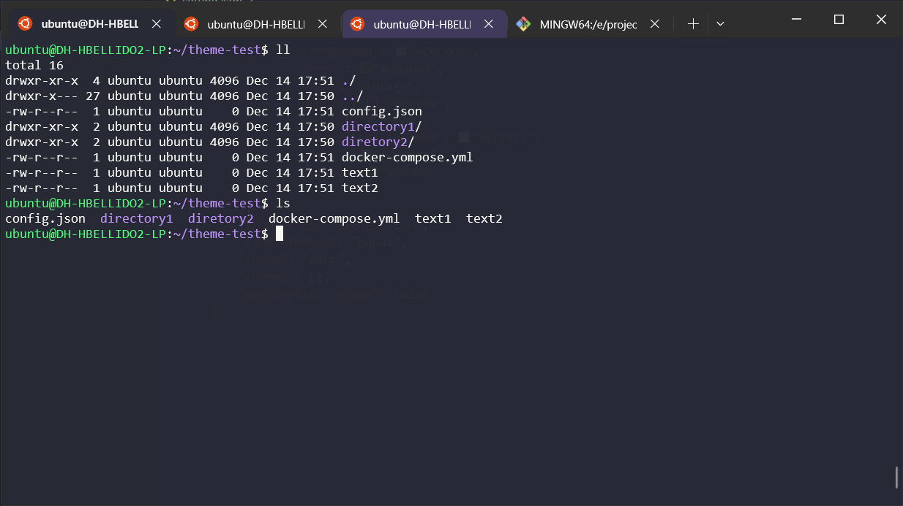

# Windows Terminal Theme Configuration

This repository contains the customized configuration for the [Windows Terminal](https://aka.ms/terminal) theme. It includes profiles, color schemes, and settings to personalize your terminal experience.

## Repository Content

- **`settings.json`**: The main configuration file for Windows Terminal that defines profiles, color schemes, fonts, and other settings.
- **Color Schemes**: A collection of custom color schemes for the terminal.
- **Documentation**: Help files to guide customization and application of the configurations.

## Prerequisites

1. Install [Windows Terminal](https://aka.ms/terminal) on your system.
2. Basic familiarity with JSON, as the `settings.json` file is written in this format.

## Installation

1. Clone this repository to your local machine:
   ```bash
   git clone https://github.com/youruser/your-repo.git
   ```

2. Copy or replace the `settings.json` file in the following location:
   ```
   %LOCALAPPDATA%\Packages\Microsoft.WindowsTerminal_8wekyb3d8bbwe\LocalState\
   ```

3. Restart Windows Terminal to apply the changes.

## Customization

You can further customize the `settings.json` file:

- **Add or Edit Profiles**: Define different environments like PowerShell, CMD, WSL, etc.
- **Change Color Schemes**: Use your favorite colors or select one from those included in this repository.
- **Fonts**: Configure your preferred fonts by adding their name in the `fontFace` field.

## Configuration Example

Here is a basic example of what a `settings.json` file might look like:

```json
{
  "profiles": {
    "defaults": {
      "colorScheme": "One Half Dark",
      "fontFace": "Cascadia Code",
      "fontSize": 12
    },
    "list": [
      {
        "guid": "{0caa0dad-35be-5f56-a8ff-afceeeaa6101}",
        "name": "PowerShell",
        "commandline": "pwsh",
        "hidden": false
      }
    ]
  },
  "schemes": [
    {
      "name": "One Half Dark",
      "black": "#282C34",
      "red": "#E06C75",
      "green": "#98C379",
      "yellow": "#E5C07B",
      "blue": "#61AFEF",
      "purple": "#C678DD",
      "cyan": "#56B6C2",
      "white": "#ABB2BF",
      "brightBlack": "#5C6370",
      "brightRed": "#E06C75",
      "brightGreen": "#98C379",
      "brightYellow": "#E5C07B",
      "brightBlue": "#61AFEF",
      "brightPurple": "#C678DD",
      "brightCyan": "#56B6C2",
      "brightWhite": "#FFFFFF"
    }
  ]
}
```

## Resources

- [Windows Terminal Official Documentation](https://aka.ms/terminal-docs)
- [Color Schemes for Windows Terminal](https://windowsterminalthemes.dev/)

## Contributions

If you have an interesting configuration or a unique color scheme, feel free to submit a pull request. Contributions are welcome!

